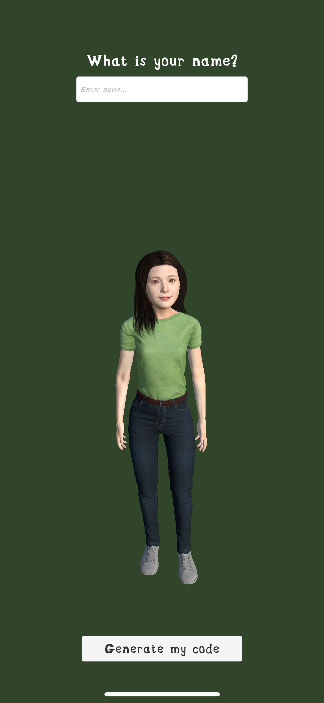
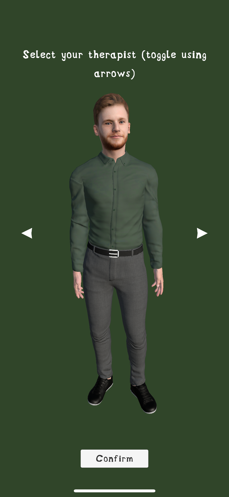
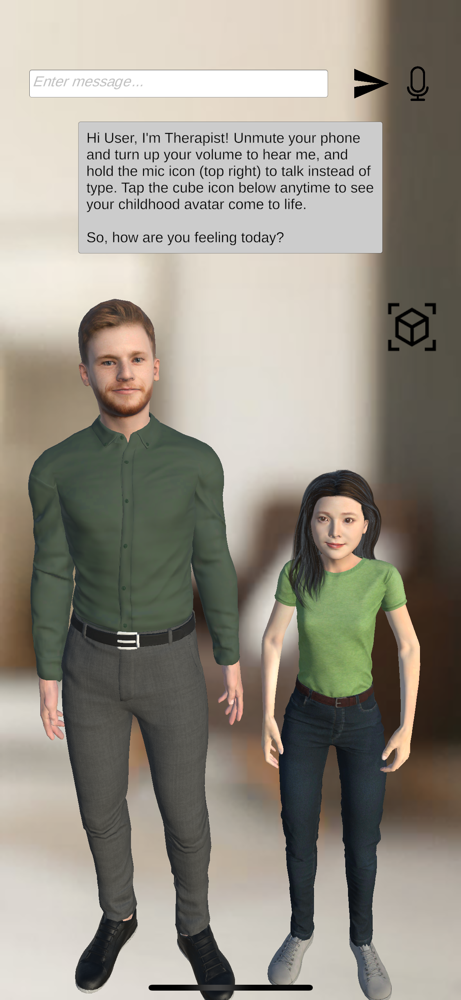

# AR Psychotherapy with Empathetic Therapist Avatar

A mobile app that enables immersive, cost-efficient psychotherapy experiences. This app works with the Algorithmic Human Development Group at Imperial College London to provide Self-Initiated Humour Protocol (SIHP) as the form of psychotherapy. Users interact with an LLM-driven therapist avatar capable of recognizing emotional tone and speech through AI/ML models in real-time. Based on these insights, the avatar provides personalised self-intervention exercises to support users’ mental well-being.

## Features
- 🧍‍♂️ Interactive Avatars - Realistic, customisable therapist and childhood self avatars powered by MetaPerson
- 🧠 Emotion Recognition - Detects user emotion from text using a fine-tuned RoBERTa ML model
- 🎭 Emotion-Responsive Animation - display user emotion on avatars via Mixamo animations and blend shape-based expressions
- 🗣️ Seamless Voice Interaction - Real-time Speech-to-Text and Text-to-Speech integration using Google Cloud API
- 🤖 Empathetic AI Therapist - Conversational support powered by Gemini LLM
- 📱 Augmented Reality Experience - Render your childhood avatar in AR using Unity
- 🧘 Personalised Mental Health Exercises - Activities and mindfulness routines tailored to your emotional state

  
  &nbsp; &nbsp; 
  &nbsp; &nbsp; 

Video demo: https://drive.google.com/file/d/1aE316lL3dd5kz9zKAdf5ekwgYWG5QxgV/view?usp=drive_link

## GCP Services
APIs: Gemini for Google Cloud, Speech-to-Text, Text-to-Speech
- For chatbot interaction page, to generate responses, allow for speech input & generate speech response
Cloud Run + Artifact Registry + Cloud Storage
- Create & push Docker image for emotion classifier Flask web server